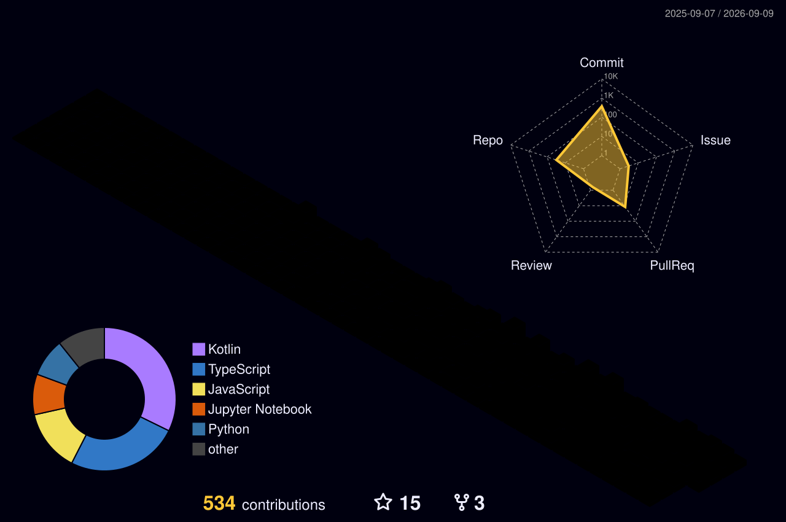

# Hi, I'm Komal

### Software Engineer · Android & Backend Developer

I'm a CS undergrad building **Android and backend applications** with a focus on
**clean architecture, scalable systems, APIs, and real-world problem solving**.

I enjoy understanding **how systems work**, not just making them work.

---

## 🚀 Featured Projects

### 🔗 [shorTea](https://github.com/komallsingh/shorTea)

**Production-focused URL shortener**

`Node.js` · `Express.js` · `TypeScript` · `PostgreSQL`

- Built URL shortening, redirects, analytics tracking, and browser/device insights.
- Integrated malicious URL detection for safer redirects.
- Designed using **layered architecture, repository pattern, validation middleware, and structured error handling**.
- Focused on scalable backend practices, API security, and efficient database design.

---

### 📱 [CodeBell](https://github.com/komallsingh/CodeBell)

**Competitive programming contest tracker for Android**

`Kotlin` · `Jetpack Compose` · `Room` · `REST APIs`

- Integrates multiple competitive programming platforms into a centralized contest tracker.
- Uses **MVVM architecture, local caching, and efficient state management**.
- Designed with clean UI principles and offline support.
- Built with scalability and maintainability in mind.

---

### 🤖 [AIVA](https://github.com/komallsingh/AIVA)

**AI-powered multimodal system**

`Python` · `Computer Vision` · `Machine Learning` · `NLP`

- Explores intelligent interaction using computer vision and machine learning.
- Implements face-based analysis including emotion, age, and gender recognition.
- Combines ML workflows, data processing, and real-world AI applications.

---

## 🎯 Currently

- 📱 Building scalable Android applications using **Kotlin, Jetpack Compose, and clean architecture**
- ⚙️ Designing backend systems with **APIs, databases, security, and cloud deployment**
- 🏗️ Exploring **System Design, distributed systems, and scalable architectures**
- 🤖 Exploring **Generative AI and machine learning applications**

---

  

---

  <b>Open to internship and career opportunities.</b>

  Continuously getting humbled by DSA problems, learning from failures,
  and improving one algorithm at a time.

  <i>It's never too late to start again.</i> ✨

